# Zotero 介紹

## 特點

這是一個

- 可導出相容於 **Word/LaTeX/Overleaf** 的文獻格式
- **跨平台**：Windows/MacOS/Linux/iOS/Android 都可以用
- **免費**且**開源**
- 可多裝置**同步**
- 可方便地在PDF檔案或是網頁上面註記
- 有很多開源且免費的插件可以擴充功能

的文獻管理軟體

## 有了 Zotero 能做什麼？

### 快速下載文獻

#### 以 [arxiv.org](https://arxiv.org/) 為例

一旦進入想下載的 paper 的頁面，[Zotero 瀏覽器插件](#zotero-電腦版與瀏覽器插件)會自動識別出這是 arxiv 上的文獻。 
點擊後 PDF 和該頁面的 html 快照會自動下載至 Zotero 當前的資料夾中。

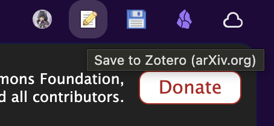

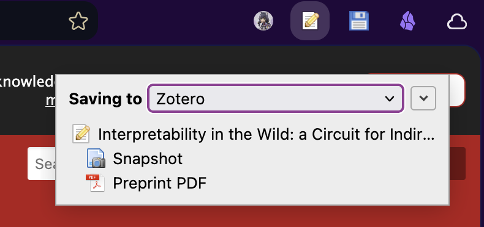

回到 Zotero，即可看到文獻的詳細資料，相關附件也整齊地收納在這個物件底下。也就是說不再需要一個一個下載再放到同一個資料夾。

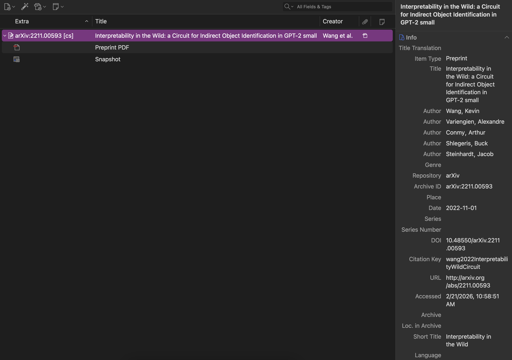

#### 以 [Medium](https://medium.com/) 為例

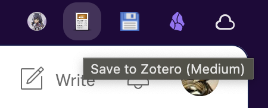
  
### 文獻閱讀與筆記

#### 在 PDF 檔上做筆記

在 Zotero 中連點兩次該文獻會開啟閱讀板面。
此時可以在文獻上做筆記、註記，若有手寫筆也可以手寫！  

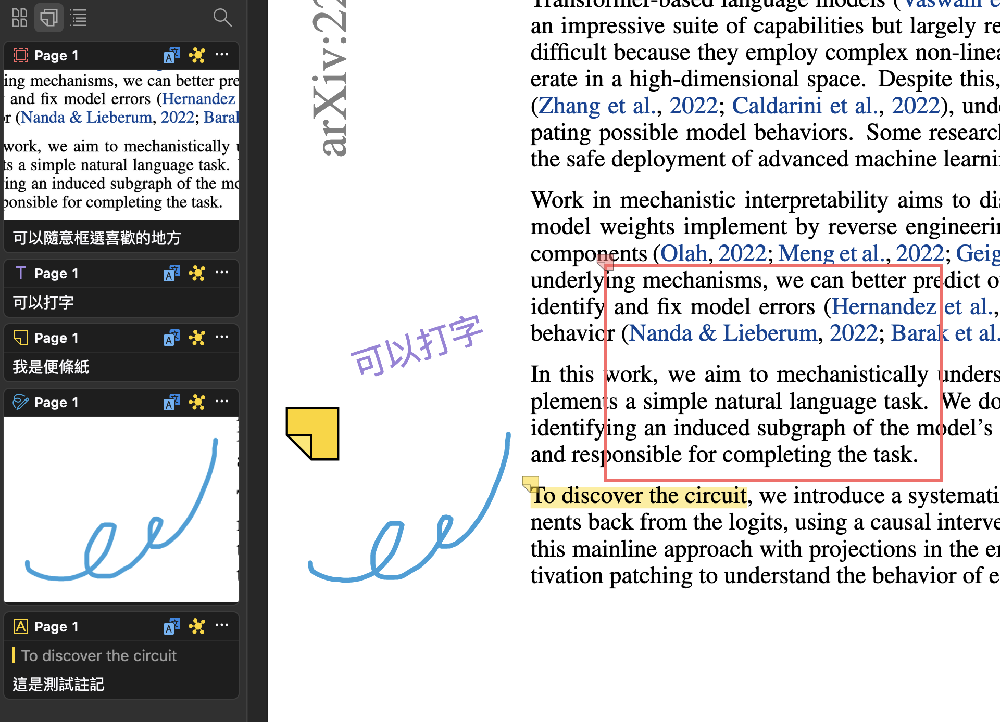

#### 在網頁上做筆記

文章以網頁快照的方式存下後，同樣可以直接在上面註記

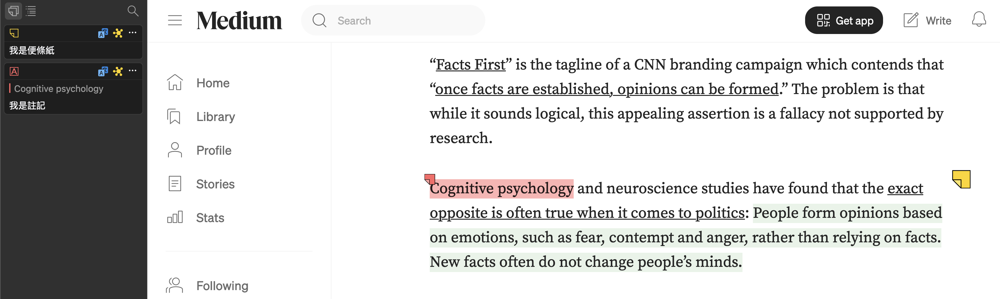

可以放大縮小！

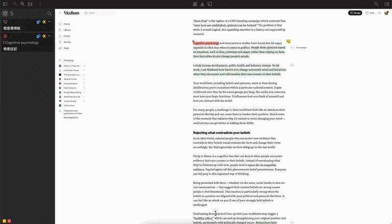

#### 論文翻譯

[點我跳轉至教學](#translate-for-zotero)

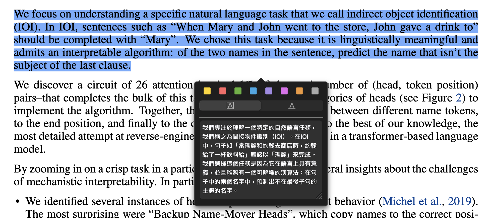

### 與 Word 連動

[點我跳轉至教學](#word)

選擇選單中的 Zotero 後，即可插入引用和新增參考文獻。

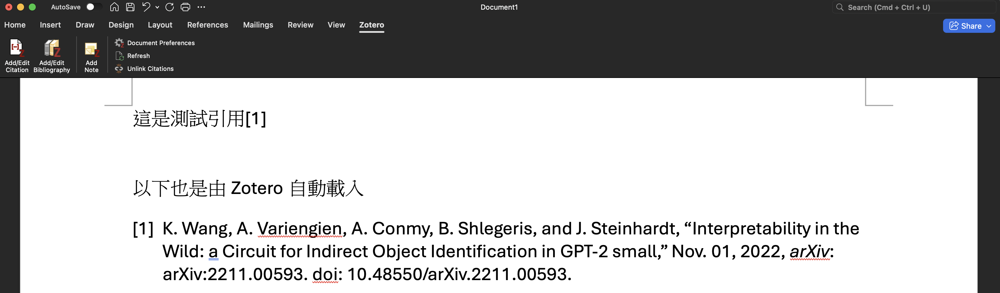

### 導出 BibTeX for LaTeX  

[點我跳轉至教學](#overleaflatex)

在安裝 Better BibTeX 插件後，可以快速取得下方的引用資料，直接貼進 LaTeX/Overleaf 中

```bibtex
@misc{wang2022InterpretabilityWildCircuit,
  title = {Interpretability in the {{Wild}}: A {{Circuit}} for {{Indirect Object Identification}} in {{GPT-2}} Small},
  shorttitle = {Interpretability in the {{Wild}}},
  author = {Wang, Kevin and Variengien, Alexandre and Conmy, Arthur and Shlegeris, Buck and Steinhardt, Jacob},
  year = {2022},
  month = nov,
  number = {arXiv:2211.00593},
  eprint = {2211.00593},
  primaryclass = {cs},
  publisher = {arXiv},
  doi = {10.48550/arXiv.2211.00593},
  urldate = {2026-02-21},
  archiveprefix = {arXiv},
  langid = {american},
}
```


### 複製格式化後的引用資料

Zotero 內建了很多不同的引用標準。
這邊以IEEE標準為例，結果如下：

```txt
[1]

K. Wang, A. Variengien, A. Conmy, B. Shlegeris, and J. Steinhardt, “Interpretability in the Wild: a Circuit for Indirect Object Identification in GPT-2 small,” Nov. 01, 2022, _arXiv_: arXiv:2211.00593. doi: [10.48550/arXiv.2211.00593](https://doi.org/10.48550/arXiv.2211.00593).
```


## 安裝

### Zotero 電腦版與瀏覽器插件

進入[Zotero 官網](https://www.zotero.org/)後，點選中央紅色的 Download 會跳轉至下載頁面。


左邊是下載對應作業系統的版本，右邊是瀏覽器插件。兩個都裝可以讓 Zotero 發揮最強大的能力！

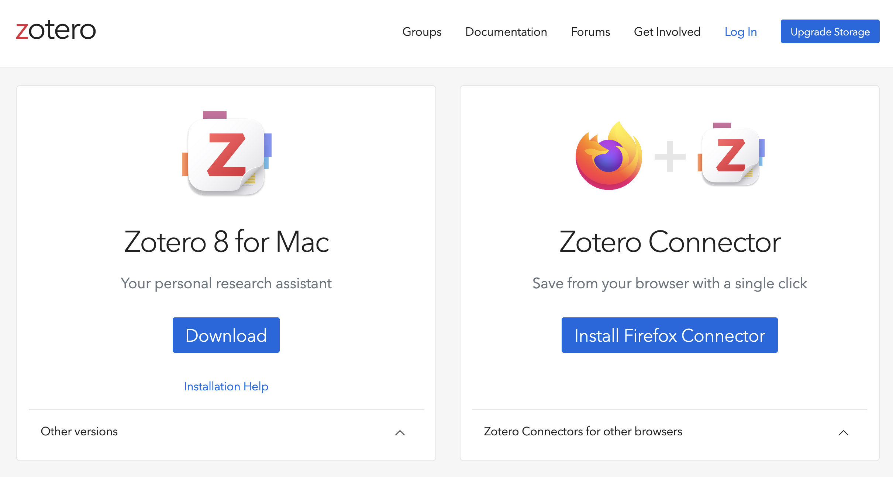

### Zotero on 手機/平板

## 基礎使用

### 1. 新增 Collection

在左上角有一個像資料夾的圖示，相當於幫 project 或是正在撰寫的論文開一個資料夾，來存放和它相關的文獻。
點進去這個 collection 後，任何從 [Zotero Connector(瀏覽器插件)](#zotero-電腦版與瀏覽器插件) 下載的文件會自動收納在這個 collection 底下。

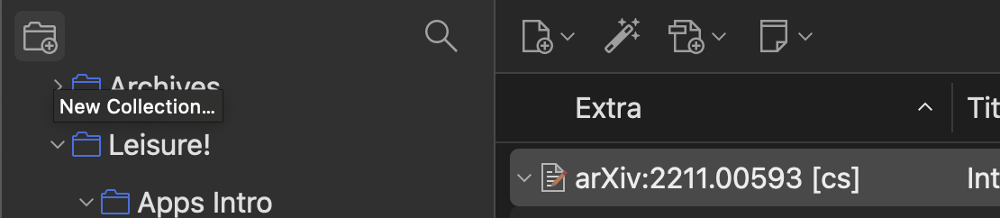

### 2. 新增文獻

除了[直接從瀏覽器導入](#快速下載文獻)之外，也可以把電腦上的檔案拖進 collection 中，會自動嘗試抓取metadata 和 PDF。
如果有抓取成功，就可以讓 Zotero 自動格式化引用。
導入後原本的那個檔案可以刪掉，因為 Zotero 已經複製一份存放在安全的地方了。

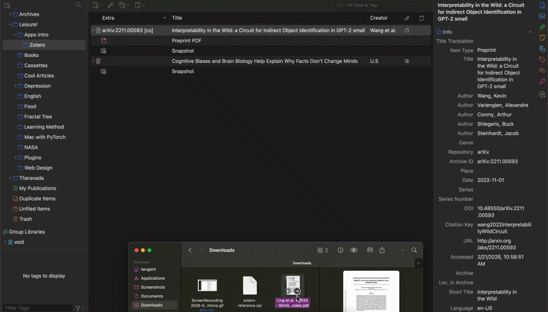

### 3. 在文獻上做筆記

請參考[這一節](#文獻閱讀與筆記)。若想使用 Zotero 來做筆記，請開啟設定 (MacOS快捷鍵：`command` + `,`)，並將 Reader 中的 `Open PDFs using` 以及 `Open snapshots using` 設定成 `Zotero`。
相反地，若想用電腦上的預設應用程式開啟，請選擇 `System Default`。

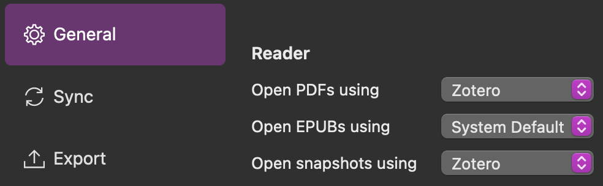

### 4. 引用文獻

#### Word

開啟 Word 後會出現 Zotero 選單。
進入 Zotero 選單，游標點在想要的位置後

1. 點擊左上角 `Add/Edit Citation`

   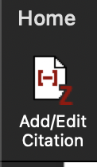
2. 選擇要引用的文獻，可以複選，選好後按 `Enter`

   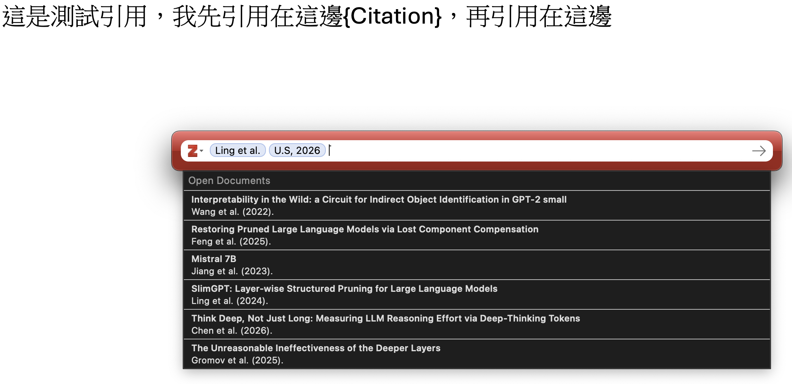
3. 成功引用

   
4. 點選「參考文獻」的位置後，再點選選單中的 `Add/Edit Bibliography` (在剛剛`Add/Edit Citation` 的右邊)

   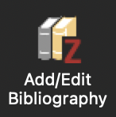
   
   就會自動把參考資料依照設定好的格式填上：
   
   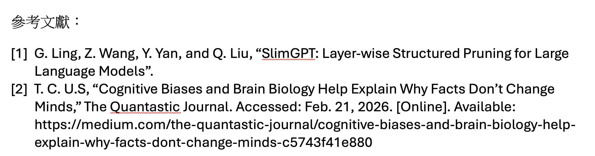
5. 之後引用其它文獻時，會自動更新參考文獻：

   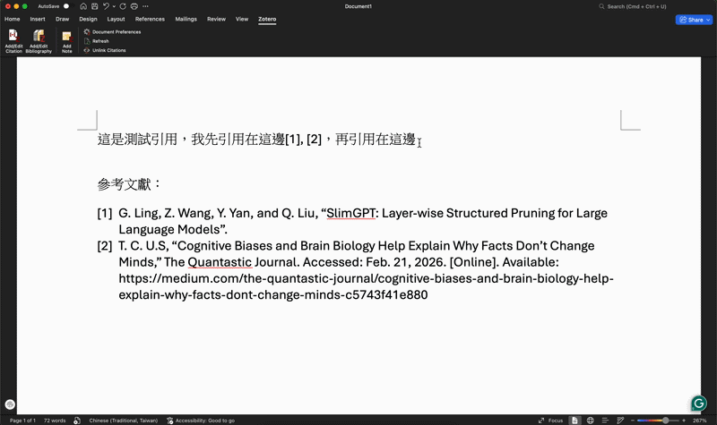

#### Overleaf/LaTeX {#overleaflatex}

以在Overleaf上編輯 `.bib` 檔為例。請先[下載 Better BibTeX 插件](#better-bibtex)。
接著，對想引用的文獻 `右鍵 -> Better BibTeX -> copy BibTeX to clipboard`

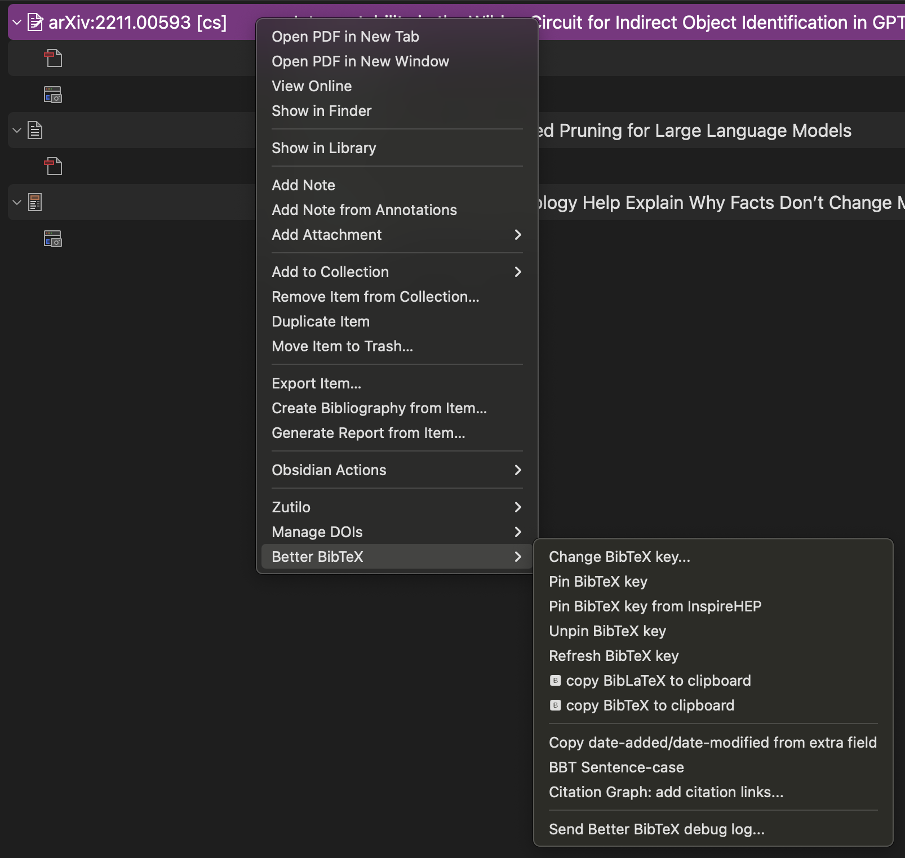

回到 Overleaf 貼上：

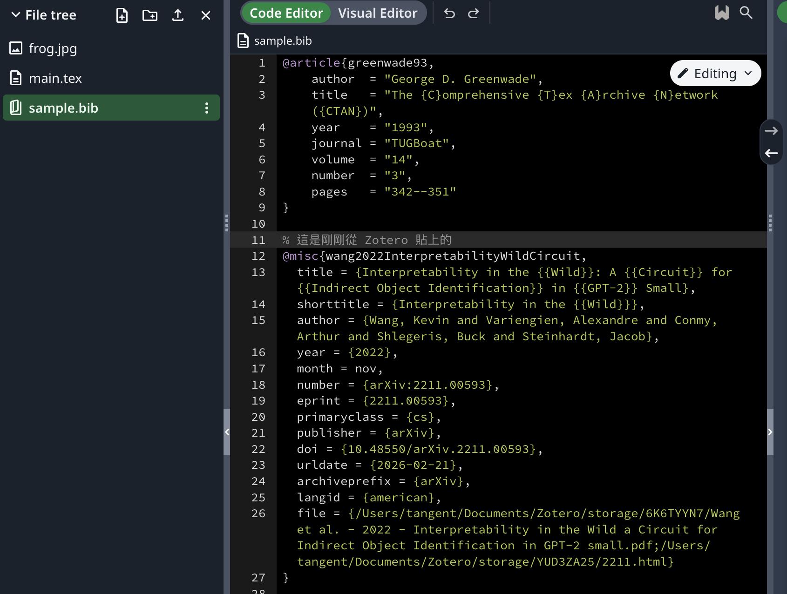

### 5. 匯出檔案

`右鍵 ->  Show in Finder` (MacOS) 可以查看原始檔案存放的位置。

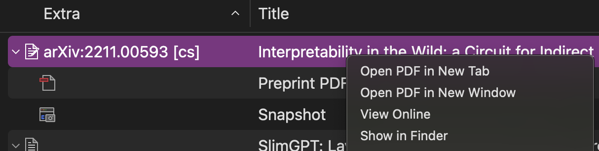

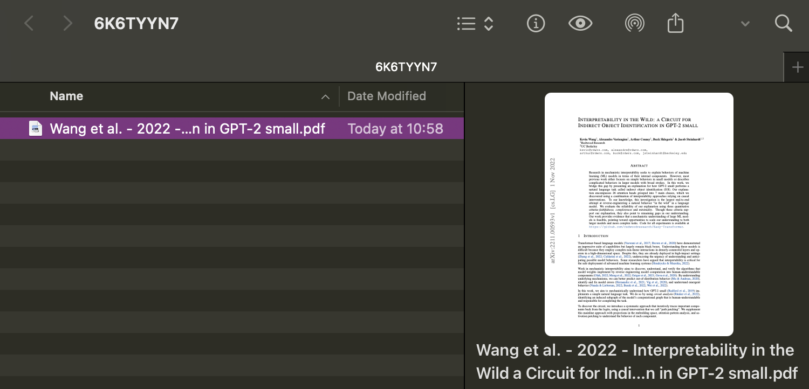

這是匯入文獻當下Zotero自己產生的副本。點開會發現上面並沒有註記，這是因為Zotero並不會直接去更改原始檔。若想與他人分享筆記，請回到 Zotero 點選想匯出的 PDF，並選擇 `File -> Export PDF...`

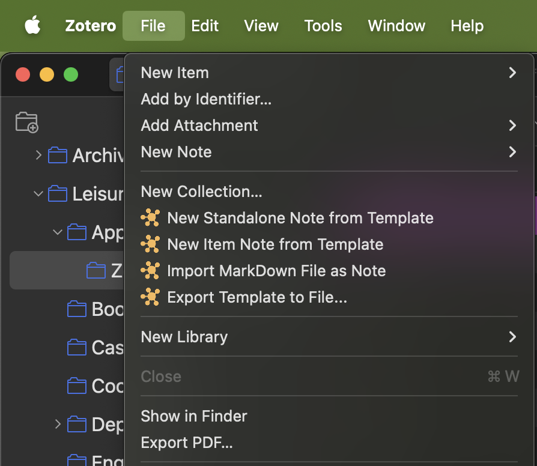

就可以匯出帶有註記的 PDF 檔並分享檔案給他人。

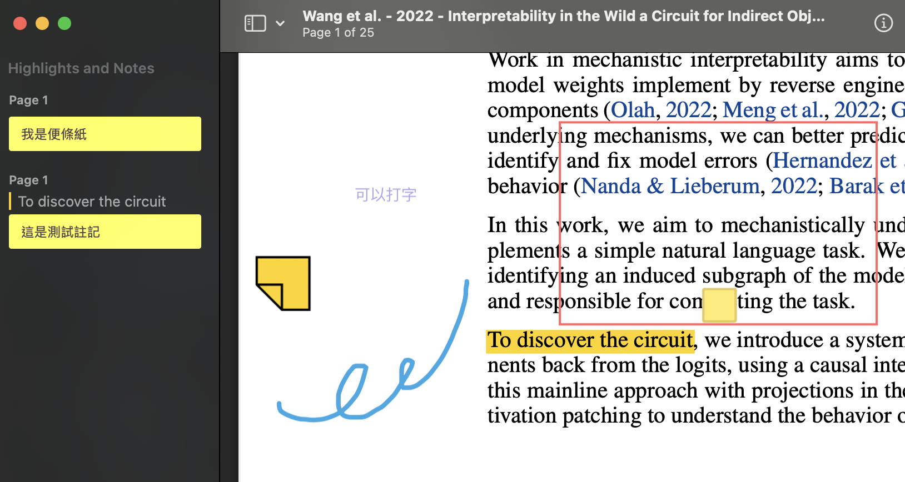

## 相關插件

Zotero有許多開源的插件，絕大部分的原始碼可以在GitHub上看到，並有很多網友一同檢視其安全性問題和功能的更新。

> [!caution] 關於第三方插件
> 雖然絕大多數的插件皆開源且免費取用，但仍有部分插件有付費後才會開放的功能。
> 
> 另外，有一些插件需要提供API Keys或是其它私人資訊，請先看過GitHub頁面相關的討論來判斷此插件是否安全。

以下以 Better BibTeX 插件為例，示範如何安裝插件。

### Better BibTeX

[GitHub 頁面](https://github.com/retorquere/zotero-better-bibtex)

1. 進入GitHub頁面後點擊 `Releases` (紅框處)

   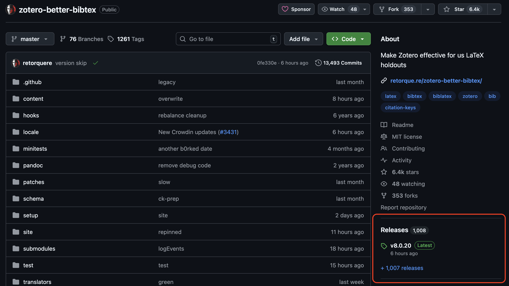
2. 找到後綴 `.xpi` 的檔案並下載。如果使用 Firefox 瀏覽器，需要 `右鍵 -> Save Link As...`

   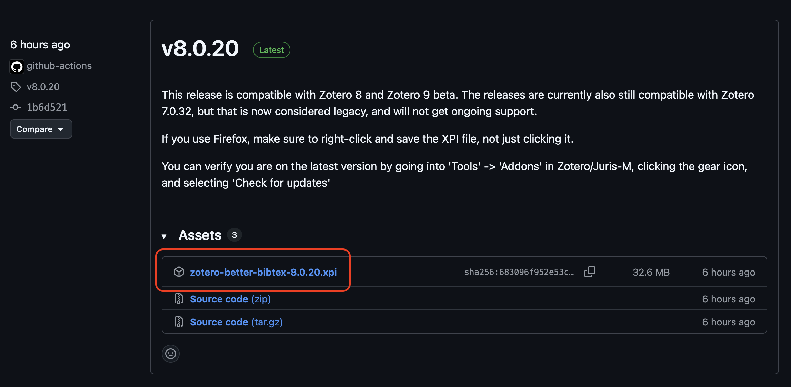
3. 回到 Zotero，點選 `Tools -> Plugins`

   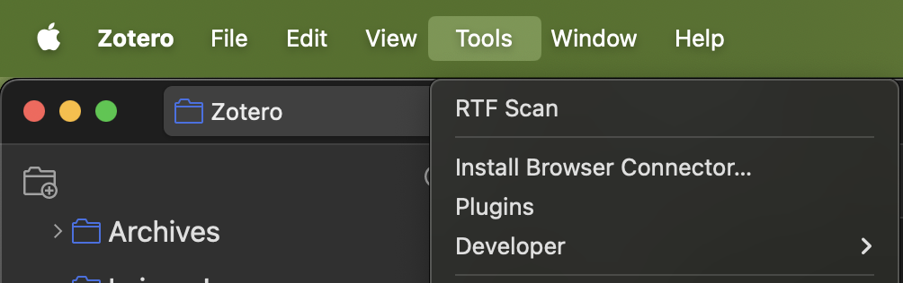
4. 在右上角的齒輪中選 `Install Plugin From File...`

   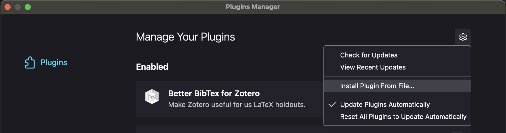
5. 選擇剛剛的 `.xpi` 檔就會安裝

   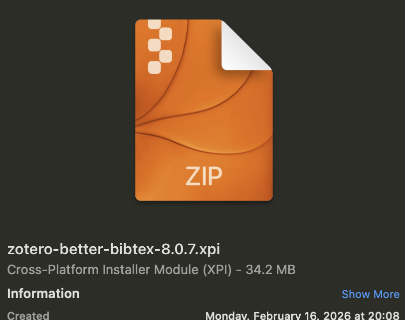
6. 安裝好後若想設定它，進 Zotero 的設定 (MacOS 快捷鍵 `command` + `,`) 即可。

### Translate for Zotero

安裝插件方式請參考[以安裝 Better BibTeX 為例的教學](#better-bibtex)

- [GitHub 頁面](https://github.com/windingwind/zotero-pdf-translate#readme)
- 若想使用自己的API key用ChatGPT來翻譯，請去Zotero 的設定 (MacOS 快捷鍵 `command` + `,`) 輸入 key

  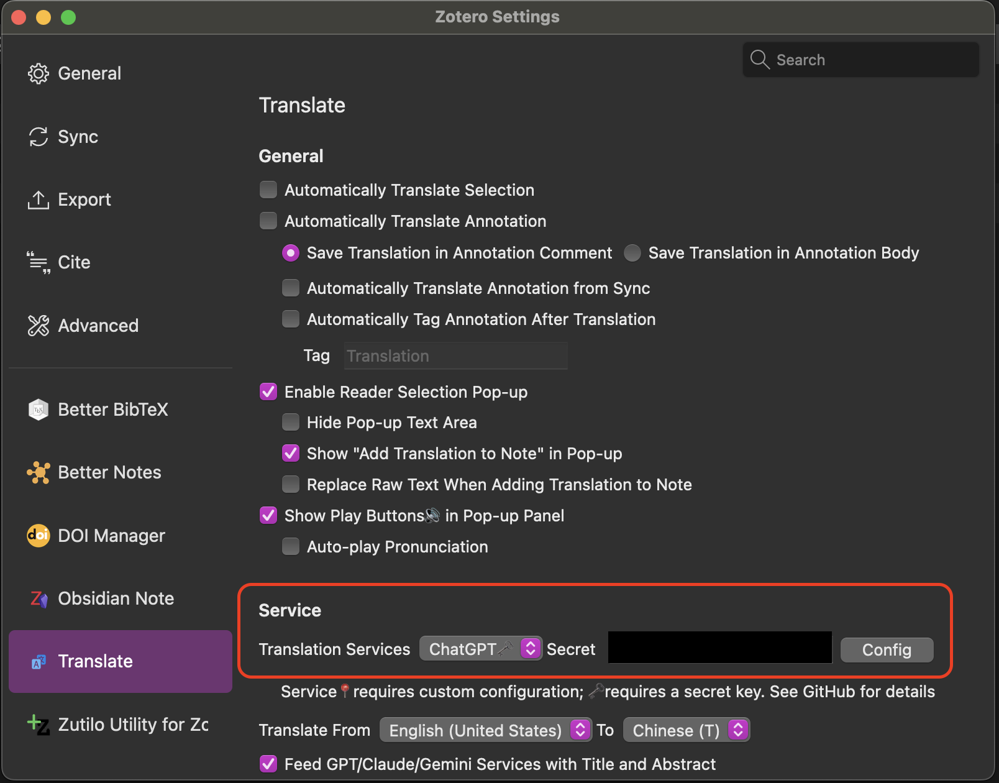

### Obsidian Notes for Zotero

- [Github 頁面](https://github.com/PKM-er/obsidian-zotlit)
- 如果有使用 Obsidian 來做筆記的話，經過設定可以做到
	- 從 Zotero 中建立筆記至 Obsidian
	
	  
	- 將 Zotero 中的註記直接拖入 Obsidian 中
	
	  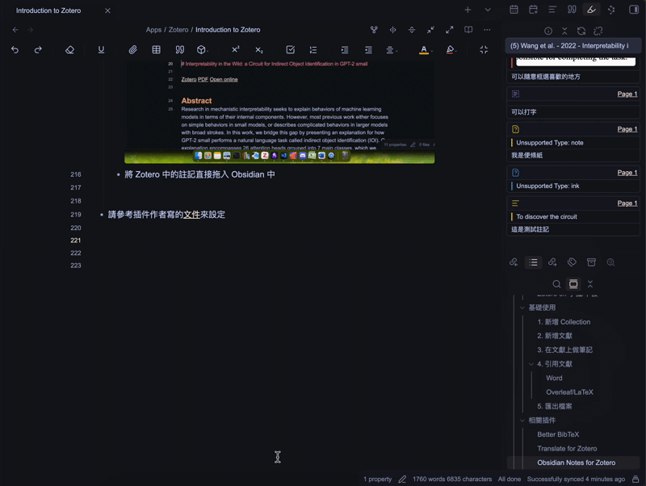
- 請參考插件作者寫的[文件](https://zotlit.aidenlx.top/)來設定


---
## 授權條款 (License)
本專案筆記採用 [GNU General Public License v3.0 (GPLv3)](LICENSE) 授權開放。
任何人皆可自由引用、修改，但請務必保留此版權聲明，並以相同授權開放。
